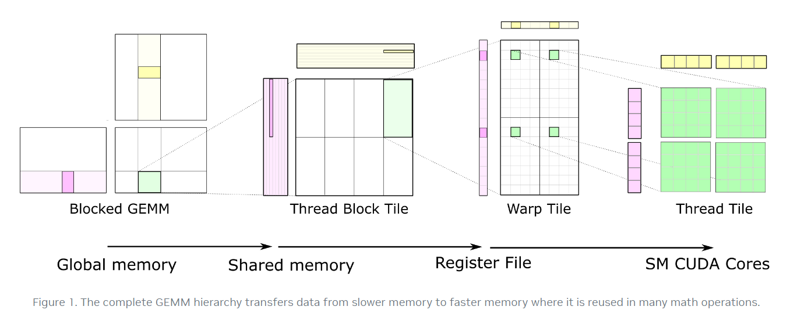
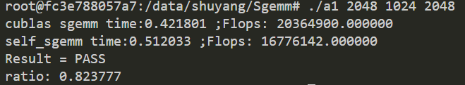

SGEMM代码主要参照如下图所示的矩阵分块思想进行



**主要优化方法：**

1、分块思想：使用共享内存、寄存器存储数据提高访问速度，减少访存的时间开销；

2、双缓冲（数据预读取）：结合硬件结构，device的数据传输部分由专门的单元执行（dram），通过一个额外的内存空间来转运数据，**使得读取数据的时											间开销能被ALU计算时掩盖部分**（计算和读数据部分异构的形式），降低整个计算时的时间开销。

trick:

​	1)、数据重排：累积A的一列乘B的一行得到的小矩阵（向量乘法）即可得到C，因此在将A小矩阵写入共享内存时（列主序）排列，使得将数据读入寄存器						  （按行读取）计算时为**连续读取**（合并）。

​	2)、float4：根据矩阵存储时（行主序）内存地址的连续性，一次读取4个浮点数，使用时根据索引获取每一个值，**提高读取数据的效率**。

**使用方法**（C=A*B）：

```c
// 编译
nvcc -arch=sm_xx sgemm.cu -o a1 -lcublas
// 执行,矩阵A(M,K),B(K,N)的维度，因分开的参数固定，所以暂时输入的维度需要是8的倍数并且是2的幂次方。
./a1 xxx xxx xxx
```

**执行结果：**



​		如图所示，运行结果展示与cublas计算的结果进行性能对比（取1000执行的平均统计结果）；使用数据预处理的方法性能能够达到cublas的80%左右，不使用大约为60%左右；维度偏小的矩阵计算，性能会下降如：128、256。

**代码参考：**

https://developer.nvidia.com/blog/cutlass-linear-algebra-cuda/

https://zhuanlan.zhihu.com/p/435908830