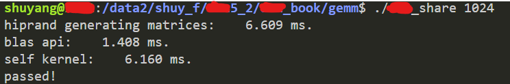

**代码简要介绍：**

1、sgemm_share:仅仅使用共享内存优化了dgemm的计算

**使用方法**：

```c
// 编译
hipcc sgemm_share.cc -o sgemm_s -I $ROCM_PATH/rocrand/include -L $ROCM_PATH/lib -lhipblas -lhiprand
// 执行,目前是方阵矩阵乘，输入维度需要是2的倍数
./sgemm_s 256
```

执行结果：



与hipblas API对比，passed表示self kernel计算结果的正确。

2、sgemm_8_2:使用了共享内存、数据预取以及减少bank冲突的优化方法，暂时是计算固定维度大小的sgemm。

